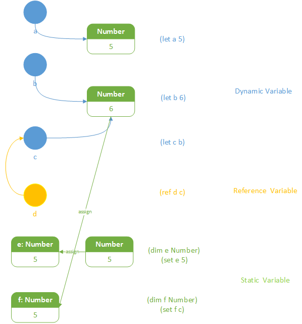

# ICM (Building)
The Interpreter of The Chill 0.3 Programming Language

**Now the "Hello World!" program can be run!**

```
ICM 0.3
> (println (+ "Hello " "World!"))
Hello World!
=> ["Hello World!"]
```

# How To Build

***You should ensure that your compiler support C++14.***<br>
If you have cmake & gcc, you can input these commands:

```
cmake .
make
```

If you have **MSVC (Visual Studio)**, you can also create a project to build these files.<br>

# How To Run
### Command Mode:
Just run the program after you have built it.
### File Mode:
Use 'icm run.chl'(Windows) or './icm run.chl'(Linux) after you have built it.
'run.chl' is a source file to test the program.

# Grammar

### ***Call Function*** : *(FunctionName Parameters...)*

```lisp
(+ 5 6)       ; Same as 5 + 6, result = 11
(+ 5 (- 7 2)) ; Same as 5 + (7 - 2), result = 10
(f x)         ; Same as f(x)
(g (f x) y)   ; Same as g(f(x), y)
```

Function is an object in the **Chill** Language.<br>
If '***a***' is a function, or it is a variable with a value of function, using '***(a ...)***' to call it, use '***a***' to get it self.

```lisp
; Example :
(defun a [n] (+ n 1)) ; define a function named 'a', with an argument named 'n', to return the value of the expression '(+ n 1)'
(defun b [n] (- n 2))
(defun add_func [fa fb n] (+ (fa n) (fb n)))
(add_func a b n)

; Same As :
(defun add_func [n] (+ (+ n 1) (- n 2)))
(add_func n)
```

'***call***' is a function to call function.

```lisp
(call + 5 6)     ; Same As (+ 5 6)
(call (disp [+]) 5 6) ; Same As ((disp [+]) + 5 6), (+ 5 6)
```

### ***Get List*** : use '*list*' to get a list object.<br>
e.g. `(list 1 2 3 5)`<br>
'**[...]**' is same as '**(list ...)**'.<br>
e.g. `[1 2 3 5]  ; same as (list 1 2 3 5)`<br>
'**disp**' is the anti-function of '**list**'.<br>
```lisp
(print 5 6 7)          ; 567
; list : Var* -> List
(print [5 6 7])        ; [5 6 7]
; disp : List -> Var*
(print (disp [5 6 7])) ; 567
```

### ***Assign*** : *(let/ref/set AssignVars... AssignValue)*<br>



'**cpy**' can provide its value's copy.

```
(let a [1 2 3])
(let b a)        ; b = [1 2 3]
(let c (cpy a))  ; c = [1 2 3], Same as (cpy b a)
(set (at a 0) 5) ; a = [5 2 3]

(p a) ; [5 2 3]
(p b) ; [5 2 3]
(p c) ; [1 2 3]
```
